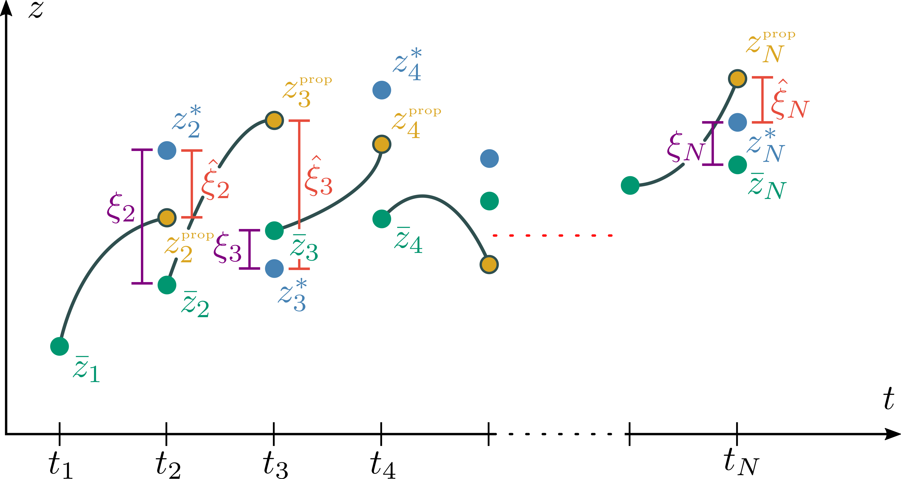

<h1 align="center">SCP Experiments</h1>

<i>Solving optimal control problems via sequential convex programming</i>

  

  

## Contents

 - [The Brachistochrone problem](https://nbviewer.org/github/abhikamath/scp-experiments/blob/6b1f01121617512d1960f28b125aa8601cd650d9/brachistochrone/ptr_scp.ipynb)

 - [Dynamic Soaring](/dynamic_soaring/)
